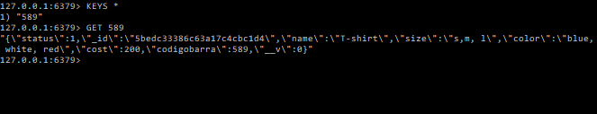

# BackEnd-FrontEnd

## *Redis*

Redis es un motor de base de datos en memoria, basado en el almacenamiento en tablas de hashes (clave/valor).
En este laboratorio se empleo para agilizar el retorno de información en una busqueda.

## *Inserción de datos*

Al momento de realizar la inserción de los datos en MongoDb tambien se hacer la inserción en Redis. Se usa como Key el CodigoBarra
y se manda el objeto Producto ya en modo de String.
En el siguiente ScreenShot se puede visualizar que la llave es guardada y por medio de esta se obtiene la información que tiene.

